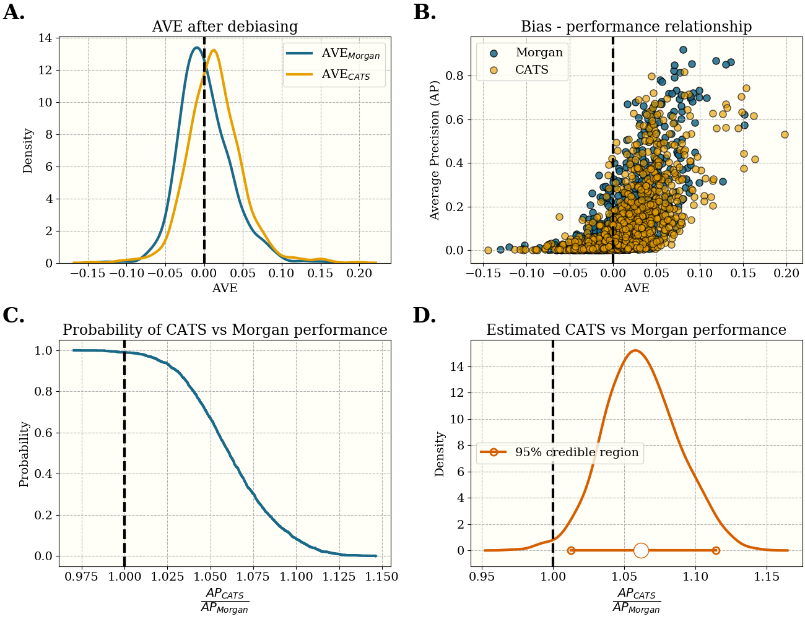

# fp_generalizability

Ligand based virtual screening uses machine learning for drug discovery. In 2018 Wallach et al. (1) demonstrated that the performance in many benchmarks was strongly correlated with bias in the train/test splits used for evaluation, and the authors of that work also proposed a genetic algorithm to reduce bias. Subsequently, using the genetic algorithm, it was shown by Sundar et al. (2) that the _de facto_ standard featurization (i.e. ECFP a.k.a. Morgan fingerprints) performs poorly when the bias is low. We extend both results - we present an algorithm for fast (~1-2s) unbiased train/test splitting, which allows us to sample hundreds of splits in an afternoon on a laptop, and we use this to compare the performance of two fingerprints (Morgan/ECFP and CATS). 


For the main result, see the figure below. 
- A) Debiasing by trimming nearest neighbors from the training set. The starting point for all fingerprints is single-linkage clustering of the Morgan fingerprints. The clusters are randomly sampled to get some test/train data. We then trim the nearest neighbors to the test data from the training data. Observe that AVE for both fingerprints reduces towards zero. 
- B) The by-now well known relationship between bias (as measured by AVE) and performance. In the manuscript we also show how you game the AVE score with the CATS fingerprint, producing low AVE without this relationship. So - be cautious when using CATS to debias!
- C) 

This shows the performance of each of the fingerprints relative to the Morgan fingerprint (A) at zero AVE bias - which is the metric of bias defined in (1). Panel B shows the performance relative to the CATS fingerprint. Morgan is among the worst, while the CATS fingerprint is among the best. One interpretation of this is that the CATS fingerprint, which was designed for scaffold hopping, generalizes better to ligands with different internal graph structure. Conversely the Morgan fingerprint, which is highly effective at differentiating graph structure, is great for nearest-neighbour search but poor at generalizing to differently-structured ligands. 





If you want to create zero-AVE splits in your own work, you could use the code below. Since the critical step (trimming the biased ligands) amounts to masking a sorted array of distances, you might also find it easier to implement your own workflow. 

```python
import numpy as np
from scipy.spatial.distance import cdist
from paris_cluster import ParisClusterer
import utils

x = np.load('my_features.npy')
y = np.load('my_labels.npy')

distance_matrix = cdist(x, x, metric='dice') #create a pairiwise distance matrix. Use whatever metric you want

#we use clustered splits. You may want to do random split or time split
clusterer = ParisClusterer(x)
clusterer.buildAdjacency() #calculates a sparse adjacency graph using pynndescent
clusterer.fit() #fits a PARIS clusterer from the sknetwork library

#do a clusterered split:
clusterer.balanced_cut(200) #aim for clusters about 200 ligands per cluster

#split the ligands:
idx = np.random.randint(y.shape[1]) #choose a random target index
clabels = np.unique(clusterer.labels_)
pos_labels = np.unique(clusterer.labels_[y[:,idx]==1])
neg_labels = clabels[~np.isin(clabels, pos_labels)]
test_clusters, train_clusters = utils.split_clusters(pos_labels, neg_labels, 0.2, [0.1,0.1], shuffle=True)
actives_test_idx, actives_train_idx, inactives_test_idx, inactives_train_idx = utils.get_four_matrices(y_,idx,clusterer,test_clusters,train_clusters)

#trim the biased ligands from the training set:
inactive_dmat = distance_matrix[inactives_test_idx]
new_inactives_train_idx = utils.trim(inactive_dmat,
                                       inactives_train_idx,
                                       inactives_test_idx,
                                   fraction_to_trim=0.2)
                                   
new_actives_train_idx = utils.trim(active_dmat,
                                    actives_train_idx,
                                    actives_test_idx,
                                     fraction_to_trim=0.2)
                                     
#now you have four sets of indices representing the split. 
#i.e. 
#actives_test_idx
#actives_train_idx
#new_inactives_train_idx
#new_actives_train_idx


```


Raise an issue in the tracker or drop a line to lewis dot martin at sydney edu au with any questions/issues. 


>(1) Wallach, Izhar, and Abraham Heifets. "Most ligand-based classification benchmarks reward memorization rather than generalization." Journal of chemical information and modeling 58.5 (2018): 916-932.
>
>(2) Sundar, Vikram, and Lucy Colwell. "The Effect of Debiasing Protein Ligand Binding Data on Generalisation." Journal of Chemical Information and Modeling (2019).
